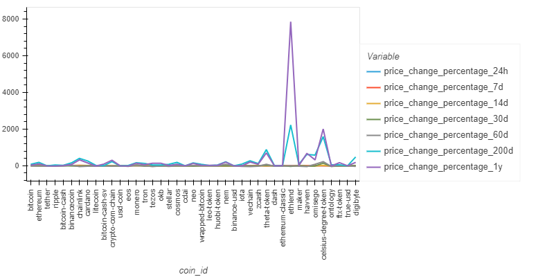
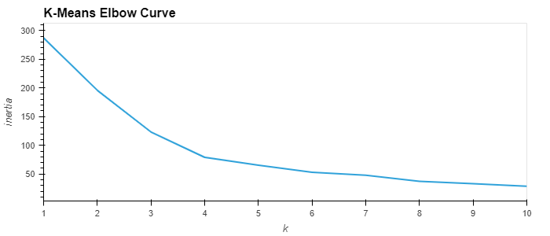
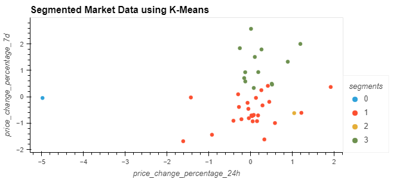
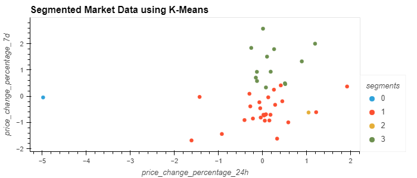
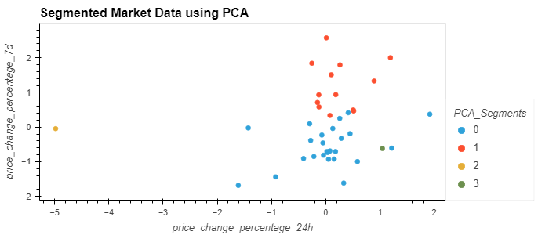
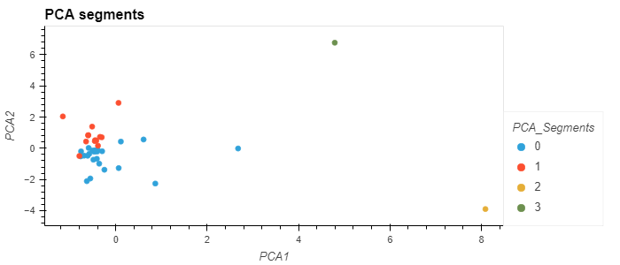

# An Approach to Assembing Crypto Portfolios

This project uses unsupervised learning to assemble price data of several crypto currencies across seven time periods.  

It then attempts to segment the data using the seven features via the `K-means` algorithm and the `elbow` method.

Finally it performs a feature reduction via the `Principal Component Analysis` algorithm to arrive at an optimum number of features and confirms that the feature reduction has not been performed at the cost of reducing the available information in the dataset.

